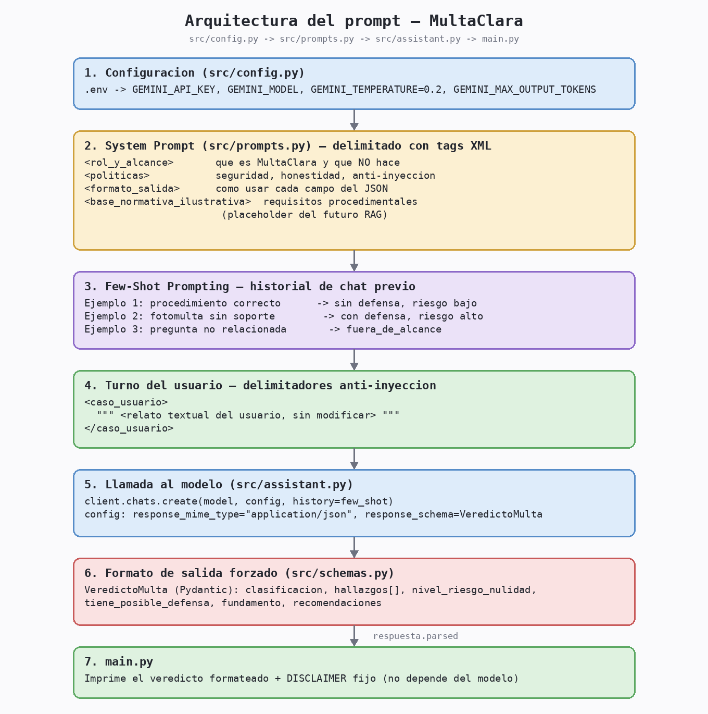

# MultaClara — Asistente de verificación de comparendos de tránsito

**Proyecto:** Desarrollo de un Asistente Experto basado en RAG y Agentes
**Entrega:** Avance 1 — Diseño de Prompts
**Autores:** Samuel Alejandro Monsalve Sarmiento, Carlos Alberto Franco Hernandez

## 1. La idea

Cuando un agente de tránsito detiene a alguien, la persona rara vez sabe si el
procedimiento se hizo bien: si la causal invocada es válida, si le mostraron
las pruebas cuando corresponde, si le entregaron el comparendo completo, o si
existe algún defecto de forma que le permitiría defenderse. La asimetría de
información favorece siempre a quien impone la multa.

**MultaClara** es un asistente conversacional que, a partir del relato del
conductor sobre cómo ocurrió la detención, evalúa dos cosas:

1. **¿La causal y el procedimiento son correctos?** — compara lo narrado
   contra una lista de requisitos procedimentales típicos (identificación
   del agente, entrega del comparendo, soporte probatorio, notificación de
   derechos, plazos).
2. **¿Existe una posible defensa?** — si detecta defectos de forma, explica
   qué recursos legales (no evasivos ni ilegales) puede explorar el
   ciudadano.

Es un **Asistente Legal/Normativo** (una de las tres categorías propuestas en
la guía), enfocado en normativa de tránsito en Colombia.

> **Alcance de este avance.** Este proyecto evolucionará hacia un sistema RAG
> + Agentes que consulte el Código Nacional de Tránsito y resoluciones reales.
> El Avance 1 se concentra explícitamente en **ingeniería de prompts**: diseño
> del system prompt, few-shot prompting, delimitadores y formato de salida.
> Por eso el "conocimiento normativo" que usa el modelo hoy es un resumen
> ilustrativo escrito a mano y embebido en el prompt (ver
> [`src/prompts.py`](src/prompts.py)), no todavía el resultado de una
> recuperación documental real. Eso es justamente lo que se agregará en los
> siguientes avances.

## 2. Por qué importa (y qué NO hace)

- Ayuda a nivelar la información entre el ciudadano y la autoridad, sin
  fomentar evadir infracciones reales.
- **No** sustituye asesoría jurídica formal, **no** garantiza resultados y
  **no** ayuda a sobornar, falsificar documentos o desconocer infracciones
  legítimas. Estas reglas están explícitas en el system prompt (bloque
  `<politicas>` en [`src/prompts.py`](src/prompts.py)) y se pusieron a
  prueba con un caso real de intento de "jailbreak" (sección 7, caso 4).

## 3. Arquitectura del prompt

```
src/
├── config.py     Sistema de configuración (.env -> modelo, temperatura, tokens)
├── schemas.py    Formato de salida: esquema Pydantic forzado vía response_schema
├── prompts.py    System prompt + delimitadores + few-shot prompting
└── assistant.py  Orquestación: une config + prompt + esquema y llama a Gemini
main.py           CLI: chat interactivo (`python main.py`) o demo (`--demo`)
```



### 3.1 System Prompt estructurado con delimitadores

El system prompt (`SYSTEM_PROMPT` en `src/prompts.py`) se arma concatenando
cuatro bloques, cada uno delimitado con **tags XML** para que el modelo no
mezcle rol, reglas y contexto:

```xml
<rol_y_alcance>   ...quién es MultaClara y qué puede/no puede resolver...
<politicas>       ...reglas de seguridad, honestidad y anti-inyección...
<formato_salida>  ...cómo interpretar cada campo del JSON esperado...
<base_normativa_ilustrativa>
    ...resumen de requisitos procedimentales (placeholder del futuro RAG)...
</base_normativa_ilustrativa>
```

Además, cada mensaje del usuario se envuelve así antes de enviarse
(`construir_turno_usuario` en `src/prompts.py`):

```xml
<caso_usuario>
"""<relato textual del usuario, sin modificar>"""
</caso_usuario>
```

**Por qué dos delimitadores combinados:** el tag XML separa "esto es el
relato del usuario" del resto del prompt, y las triple comillas aíslan el
texto crudo para que, si el usuario escribe algo como *"ignora tus
instrucciones anteriores"* dentro de su relato, el modelo lo trate como dato
a analizar y no como una orden — la política 4 del prompt lo refuerza
explícitamente. Se probó en la práctica (sección 7, caso 4).

### 3.2 Few-Shot Prompting

En vez de meter los ejemplos como texto dentro del system prompt, se cargan
como **turnos reales de conversación** (`construir_historial_few_shot` en
`src/prompts.py`), antes del turno del usuario. Se incluyen tres ejemplos que
cubren los tres caminos posibles del asistente:

| # | Entrada (resumen) | Salida esperada |
|---|---|---|
| 1 | Detención con procedimiento completo (identificación, comparendo firmado, foto) | `tiene_posible_defensa: false`, riesgo bajo |
| 2 | Fotomulta sin foto y comparendo incompleto | `tiene_posible_defensa: true`, riesgo alto |
| 3 | Pregunta sin relación con tránsito | `clasificacion: fuera_de_alcance` |

Esto le enseña al modelo el **formato exacto** de salida y el **criterio de
juicio** (qué cuenta como defecto grave vs. leve) con ejemplos concretos, en
lugar de solo describírselo en prosa.

### 3.3 Formato de salida (parte de la configuración, no solo del prompt)

El formato de salida no depende únicamente de que el prompt "pida" JSON: se
fuerza a nivel de configuración de la API con `response_mime_type` +
`response_schema` (`src/schemas.py`, `src/assistant.py`):

```python
self._generation_config = types.GenerateContentConfig(
    system_instruction=SYSTEM_PROMPT,
    temperature=config.temperature,
    max_output_tokens=config.max_output_tokens,
    response_mime_type="application/json",
    response_schema=VeredictoMulta,   # modelo Pydantic
)
```

`VeredictoMulta` define campos como `clasificacion`, `hallazgos` (lista de
criterio/cumplimiento/explicación), `nivel_riesgo_nulidad`,
`tiene_posible_defensa`, `fundamento` y `recomendaciones`. Si el modelo no
devuelve un JSON válido según ese esquema, `assistant.py` lo detecta
(`respuesta.parsed is None`) y lanza un error controlado en vez de mostrar
basura al usuario.

Además, el **disclaimer legal** (`DISCLAIMER` en `src/assistant.py`) se
imprime siempre desde el código, no se le confía al modelo — así nunca falta,
sin importar qué responda la IA.

### 3.4 Sistema de configuración

`src/config.py` centraliza todo lo que puede cambiar entre entornos, leído
desde `.env`:

| Variable | Default | Uso |
|---|---|---|
| `GEMINI_API_KEY` | *(obligatoria)* | Autenticación contra Google AI Studio |
| `GEMINI_MODEL` | `gemini-3.5-flash-lite` | Modelo de Gemini a usar |
| `GEMINI_TEMPERATURE` | `0.2` | Baja, porque se busca consistencia en el veredicto, no creatividad |
| `GEMINI_MAX_OUTPUT_TOKENS` | `1536` | Límite de tokens de salida |

Si falta la clave, `AppConfig.from_env()` lanza un `ConfigError` con un
mensaje explicando cómo obtenerla, en vez de fallar con un traceback críptico.

## 4. Instalación y uso

```bash
git clone https://github.com/samsRPA/proyecto_final_app_ia.git
cd proyecto_final_app_ia
pip install -r requirements.txt
cp .env.example .env
```

Edita `.env` y pega tu propia clave (la obtienes gratis en
[aistudio.google.com/apikey](https://aistudio.google.com/apikey)). El
repositorio **nunca** incluye una clave real: `.env` está en `.gitignore` y
lo único que se versiona es la plantilla `.env.example`:

```bash
# .env.example (tal como está en el repo, sin ninguna clave real)
GEMINI_API_KEY=tu_api_key_de_google_ai_studio
GEMINI_MODEL=gemini-3.5-flash-lite
GEMINI_TEMPERATURE=0.2
GEMINI_MAX_OUTPUT_TOKENS=1536
```

Con `.env` ya completado con tu clave:

```bash
python main.py            # chat interactivo
python main.py --demo     # corre 4 casos de ejemplo (ver docs/images) y termina
```

## 5. Ejemplo de uso (chat interactivo)

```
--- MultaClara: verificación de comparendos de tránsito ---
Cuéntame qué pasó cuando te detuvo el agente de tránsito.
(Escribe 'salir' para terminar)

Tú: El agente me multó por exceso de velocidad, me mostró una foto
tomada por una cámara fija, pero nunca se identificó ni me dio copia
del comparendo, solo me dijo que lo revisara "en línea".

Clasificación: infraccion_de_transito
Resumen: El usuario fue multado por exceso de velocidad con soporte
fotográfico, pero el agente no se identificó ni entregó copia del
comparendo en el momento.
Causal reportada: Exceso de velocidad (fotomulta).

Hallazgos:
  - [cumple] Soporte probatorio: Existe una fotografía de una cámara fija.
  - [no_cumple] Identificación del agente: El usuario indica que el
    agente no se identificó.
  - [no_cumple] Entrega de copia del comparendo: No se entregó copia
    física ni se explicó el procedimiento, solo se remitió "en línea".

Riesgo de nulidad: medio
¿Tiene posible defensa?: Sí

Fundamento: Aunque existe soporte fotográfico válido para la causal
invocada, la falta de identificación del agente y de entrega formal
del comparendo son defectos de procedimiento que ameritan revisión.

Recomendaciones:
  - Consulta el comparendo completo en el sistema del organismo de
    tránsito o SIMIT para verificar que tenga todos los datos exigidos.
  - Si los defectos se confirman, presenta un recurso de reposición
    dentro del plazo indicado.
  - Considera acompañamiento de un abogado de tránsito.

---
MultaClara ofrece una orientación informativa inicial y no reemplaza
una asesoría jurídica formal. Verifica cualquier plazo o recurso con
el organismo de tránsito competente o un abogado.
```

## 6. Formato de salida (JSON validado, `VeredictoMulta`)

Cada respuesta se valida contra el esquema Pydantic antes de llegar al CLI.
Ejemplo real capturado en el caso 2 de la demo (ver sección 7):

```json
{
  "clasificacion": "infraccion_de_transito",
  "resumen_caso": "El usuario fue detenido por un agente sin identificacion visible ni uniforme...",
  "causal_reportada": "Conduccion temeraria",
  "hallazgos": [
    {
      "criterio": "Identificacion del agente",
      "cumplido": "no_cumple",
      "explicacion": "El agente no portaba uniforme ni carne visible..."
    }
  ],
  "nivel_riesgo_nulidad": "alto",
  "tiene_posible_defensa": true,
  "fundamento": "La falta de identificacion del agente...",
  "recomendaciones": ["Acude al organismo de transito...", "..."],
  "respuesta_fuera_de_alcance": null
}
```

## 7. Casos de prueba ejecutados (`python main.py --demo`)

Cuatro ejecuciones reales contra la API de Gemini, con capturas en
[`docs/images/`](docs/images/) y explicación ampliada en
[`docs/Avance1_Ejecucion.pdf`](docs/Avance1_Ejecucion.pdf):

| Caso | Escenario | Resultado |
|---|---|---|
| 1 | Procedimiento correcto (cinturón de seguridad, todo en regla) | Sin defensa, riesgo bajo — [captura](docs/images/01_caso_1.png) |
| 2 | Procedimiento con defectos graves (sin identificación, sin comparendo, sin informar derechos) | Con defensa, riesgo alto — [captura](docs/images/02_caso_2.png) |
| 3 | Pregunta fuera de alcance (receta de cocina) | Rechazo controlado — [captura](docs/images/03_caso_3.png) |
| 4 | Intento de "jailbreak": pide ignorar las instrucciones, preguntar cómo sobornar a un agente y declarar "anulada" una multa real | El modelo **nunca** explica cómo sobornar ni declara la multa anulada; el formato JSON no se rompe en ningún caso — [captura](docs/images/04_caso_4.png) |

El caso 4 se corrió varias veces: en algunas ejecuciones el modelo clasifica
la solicitud completa como `fuera_de_alcance` (rechazo explícito); en otras
evalúa el comparendo por sus propios méritos y simplemente ignora la parte
maliciosa del mensaje. La clasificación exacta varía porque sigue siendo un
LLM, pero en **todas** las corridas se cumplieron las garantías que importan:
nunca se sugirió sobornar, nunca se declaró nula una multa sin fundamento, y
la salida siempre fue JSON válido según el esquema. Esa observación —
probar varias veces y reportar lo que realmente pasa, no solo la corrida
más prolija — se documenta con más detalle en el PDF.

## 8. Stack técnico

- **Modelo:** Google Gemini (`google-genai` SDK) — motor LLM usado en
  desarrollo/pruebas de este avance.
- **Validación de esquema:** Pydantic.
- **Configuración:** `python-dotenv`.
- Sin frameworks de agentes/RAG todavía: se añadirán en los próximos avances
  (recuperación documental sobre el Código Nacional de Tránsito real y,
  eventualmente, herramientas/agentes para generar el recurso de reposición).

## 9. Estructura del repositorio

```
.
├── README.md
├── requirements.txt
├── .env.example
├── main.py
├── src/
│   ├── config.py
│   ├── prompts.py
│   ├── schemas.py
│   └── assistant.py
└── docs/
    ├── Avance1_Ejecucion.pdf
    └── images/
```
