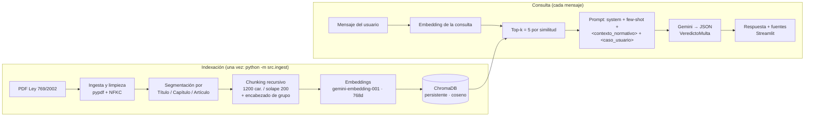

# MultaClara — Asistente de verificación de comparendos de tránsito (RAG)

**Proyecto:** Desarrollo de un Asistente Experto basado en RAG y Agentes
**Entrega:** Avance 2 — Flujo RAG completo, evaluación con Ragas y chat desplegado
**Autores:** Samuel Alejandro Monsalve Sarmiento, Carlos Alberto Franco Hernandez

**🔗 Aplicación desplegada:** `PENDIENTE — pegar aquí la URL pública de Streamlit`
**📦 Repositorio:** https://github.com/samsRPA/proyecto_final_app_ia

## 1. La idea

Cuando un agente de tránsito detiene a alguien, la persona rara vez sabe si el
procedimiento se hizo bien: si la causal es válida, si le entregaron el
comparendo completo, o si hay un defecto de forma que le permita defenderse.

**MultaClara** es un asistente conversacional que, a partir del relato del
conductor, evalúa **(1)** si la causal y el procedimiento cumplen los
requisitos formales y **(2)** si existe una posible defensa legal. Desde el
Avance 2 **fundamenta cada respuesta en la Ley 769 de 2002 (Código Nacional de
Tránsito)** recuperada con RAG y muestra de qué artículo sale cada afirmación.

No sustituye a un abogado, no emite fallos y **no** ayuda a sobornar, falsificar
ni desconocer infracciones reales (política 3 del system prompt).

## 2. Flujo RAG implementado



### 2.1 Selección de documentos

Corpus: **Ley 769 de 2002** (`data/raw/ley_0769_2002.pdf`, 172 artículos). Es la
norma base de tránsito en Colombia: define las infracciones, el procedimiento
del comparendo, las multas y los recursos, que es exactamente lo que el
asistente debe contrastar con el relato del usuario. El PDF incluye las
modificaciones posteriores (Ley 1383/2010, Decreto 019/2012, Ley 1696/2013…).

### 2.2 Ingesta ([`src/ingest.py`](src/ingest.py))

Lee PDF, HTML, TXT y DOCX. Normaliza Unicode (NFKC) para descomponer las
ligaduras tipográficas del PDF (`fi` → `fi`), que de otro modo rompen la
búsqueda, y elimina ruido de portales legislativos. Detecta cada
`ARTÍCULO N` (tolerando `ARTÍCULO3°` pegado, como viene en el PDF) y arrastra
el `TÍTULO` y `CAPÍTULO` vigentes como metadatos.

### 2.3 Chunking y justificación de parámetros

| Parámetro | Valor | Justificación |
|---|---|---|
| Criterio de corte | Primero por **artículo**; los que exceden el tamaño se subdividen con `RecursiveCharacterTextSplitter` (párrafo → PARÁGRAFO → línea → `; ` → `. ` → palabra) | El artículo es la unidad natural de significado legal y la unidad que debe citarse. Cortar a ciegas mezclaría artículos y rompería las citas. |
| `chunk_size` | 1200 caracteres | Cabe un artículo corto entero (idea legal completa) pero el vector sigue siendo específico. Longitud media real: 786. |
| `chunk_overlap` | 200 (~17 %) | Si un corte cae a media idea, el final del chunk anterior se repite. Rango habitual 10–20 %. |
| Encabezado de contexto | `[Ley 769 de 2002, Art. N \| TÍTULO \| CAPÍTULO]` antes de vectorizar | El vector "sabe" a qué norma pertenece. |
| Encabezado de grupo de multa | Cada chunk del Art. 131 repite su grupo (`C. Será sancionado… quince (15) SMLDV…`) | Ver iteración de mejora (§4.3). |

Resultado: **315 chunks**. Metadatos de cada chunk: `documento`, `articulo`,
`titulo`, `capitulo`, `archivo`, `cita`, `parte`, `total_partes`.

### 2.4 Vectorización y base de datos vectorial

- **Embeddings:** `gemini-embedding-001`, 768 dimensiones (reducción Matryoshka:
  menos espacio y latencia con pérdida mínima). Se usa `task_type`
  `RETRIEVAL_DOCUMENT` al indexar y `RETRIEVAL_QUERY` al consultar. Se eligió
  por su buen desempeño multilingüe y porque reutiliza la misma API y clave del
  LLM (un solo proveedor, despliegue simple).
- **Vector DB:** **ChromaDB** persistente en `chroma_db/` (9 MB, viaja con el
  repo), espacio **coseno**. Guarda los metadatos que permiten citar la
  fuente, y registra el modelo de embeddings en la colección: `Retriever`
  se niega a consultar si no coincide con el de la configuración.

### 2.5 Recuperación ([`src/retriever.py`](src/retriever.py))

Búsqueda por similitud coseno, `top_k = 5` (equilibrio entre cobertura y
ruido/costo; se puede variar con `RAG_TOP_K`). Para mensajes de seguimiento
cortos (< 15 palabras, p. ej. "¿y si no pago?") la consulta de recuperación
incluye también el mensaje anterior del usuario, porque solo no sirve para
buscar.

### 2.6 Generación ([`src/prompts.py`](src/prompts.py), [`src/assistant.py`](src/assistant.py))

Se reutiliza y refina el diseño del Avance 1 (system prompt en bloques XML,
few-shot como historial, delimitadores, salida JSON forzada con Pydantic).
Cambios del Avance 2:

- El bloque `<base_normativa_ilustrativa>` escrito a mano se **reemplazó** por
  `<base_normativa>` (instrucciones de uso del contexto). El contexto real llega
  en cada turno dentro de `<contexto_normativo>`, con un `<fragmento>` por cada
  resultado recuperado y su fuente.
- **Política 2 reescrita:** antes prohibía citar artículos; ahora permite citar
  **solo** artículos presentes en el contexto y **solo** para la afirmación que
  ese fragmento respalda. Lo que el contexto no establece no se presenta como
  exigencia legal. Las demás políticas (anti-inyección, no sobornos, fuera de
  alcance) y el esquema `VeredictoMulta` se mantienen.
- **Validación de citas:** tras responder, el código verifica que los artículos
  citados estén entre los fragmentos recuperados (`RespuestaRAG.citas_no_respaldadas`)
  y la interfaz avisa si no es así.
- **Historial:** los turnos previos se reenvían al LLM sin el contexto antiguo
  (solo el turno actual lleva fragmentos), lo que permite preguntas de
  seguimiento sin inflar el prompt.

## 3. Estructura del repositorio

```
.
├── app.py                 Interfaz de chat (Streamlit)
├── main.py                CLI (chat o --demo)
├── ragas_eval.py          Evaluación con Ragas
├── src/
│   ├── config.py          Configuración (.env / secrets)
│   ├── schemas.py         VeredictoMulta (Pydantic)
│   ├── prompts.py         System prompt, delimitadores, few-shot
│   ├── ingest.py          Ingesta + chunking + indexación en Chroma
│   ├── embeddings.py      Cliente de embeddings de Gemini
│   ├── retriever.py       Recuperación por similitud
│   └── assistant.py       Orquestación RAG + LLM
├── data/raw/              Corpus (Ley 769 de 2002)
├── chroma_db/             Índice vectorial persistente
├── eval/
│   ├── dataset_eval.json  20 preguntas con ground truth
│   └── runs/              Resultados de cada corrida de Ragas
├── docs/                  Avance 1 (PDF y capturas)
├── requirements.txt       Dependencias de la app
└── requirements-eval.txt  Dependencias extra para Ragas
```

## 4. Evaluación con Ragas

### 4.1 Dataset ([`eval/dataset_eval.json`](eval/dataset_eval.json))

20 preguntas, cada una con respuesta de referencia (*ground truth*) escrita a
partir del texto real de la ley:

- **16 dentro del corpus:** cinturón, multas, procedimiento del comparendo,
  firma, recursos, caducidad, prescripción, notificación, velocidad,
  inmovilización, embriaguez, casco, SOAT…
- **2 sin respuesta en el corpus** (parecen del dominio pero la base no las
  cubre): control de alucinación.
- **2 fuera de alcance:** soborno a un agente y "multa por volar en escoba".

Como la salida del RAG es JSON estricto, `ragas_eval.py` extrae la
justificación en prosa (`fundamento` + explicaciones de los hallazgos, o
`respuesta_fuera_de_alcance`) y esa es la `response` evaluada.

### 4.2 Resultados (juez: `gemini-3.5-flash-lite`, `top_k=5`)

Las 4 métricas Ragas se promedian sobre las 16 preguntas dentro del corpus. Las
de control se juzgan por su comportamiento de rechazo (`rechazo_correcto`).

| Métrica | Qué mide | baseline | + encabezado de grupo | Δ |
|---|---|---|---|---|
| faithfulness | Fidelidad al contexto (generación) | 0.956 | 0.984 | +0.028 |
| answer_relevancy | Relevancia de la respuesta (generación) | 0.867 | 0.926 | +0.059 |
| context_precision | Precisión del contexto (recuperación) | 0.908 | 0.960 | +0.052 |
| context_recall | Cobertura del contexto | 1.000 | 1.000 | 0 |
| hit_articulo (sin LLM) | El artículo esperado está en el top-k | 1.000 | 1.000 | 0 |
| rechazo_correcto | Rechazo en las 4 preguntas de control | 1.00 | 0.75 | −0.25 |

Detalle por pregunta en `eval/runs/*_ragas.json`; respuestas completas y
fragmentos recuperados en `eval/runs/*_respuestas.json`.

### 4.3 Análisis e iteración de mejora

**Métrica más baja del baseline: `answer_relevancy` (0.867)**, seguida de
`context_precision` (0.908). Casi todo ese hueco venía de **una pregunta**: la 2
("¿con cuánta multa se sanciona no usar el cinturón?"), con fidelidad 0.5,
relevancia 0.0 y precisión 0.0. El modelo respondió que "la base no precisa el
monto", pero el Art. 131 sí lo dice (15 SMLDV).

**Diagnóstico → chunking.** El Art. 131 mide ~28 000 caracteres y se parte en
29 chunks. El encabezado del grupo ("C. Será sancionado con multa equivalente a
quince (15) SMLDV…") quedaba lejos de sus ítems (C.1…C.n): el chunk con "C.6.
No utilizar el cinturón…" no traía la multa, y el chunk con "quince (15)" no
traía C.6. El modelo recibió ambos pero no pudo vincularlos, y prefirió no
inventar (por eso la fidelidad no cayó a 0). Es un fallo de **chunking** que se
manifiesta en la **generación**. Nótese que `context_recall` y `hit_articulo`
valían 1.0 y **no lo detectaron**: el fragmento correcto sí se recuperaba;
el problema solo se vio leyendo las respuestas.

**Mejora aplicada:** repetir en cada chunk del Art. 131 el encabezado de su
grupo de multa (`RAG_CABECERA_GRUPOS=0` reproduce el baseline). Es un arreglo
dirigido a la estructura de ese artículo, no una mejora general.

**Resultado:** la pregunta 2 ahora responde "quince (15) SMLDV (Art. 131)". Las
tres métricas afectadas suben, y las demás 15 preguntas quedan prácticamente
iguales: **la mejora proviene de ese único caso**, y las diferencias de ±0.1 en
otras preguntas son ruido (modelo y juez no deterministas, n = 16).

**Sobre la baja en `rechazo_correcto` (1.00 → 0.75):** la pregunta 17
("conducción temeraria") la planteamos como ausente de la ley. No lo es: el
Art. 131, grupo D, ítem D.7, sanciona "conducir realizando maniobras altamente
peligrosas e irresponsables que pongan en peligro a las personas o las cosas"
(30 SMLDV). Con el encabezado repetido el modelo ahora lo encuentra y responde
con fidelidad 1.0 y sin citas inventadas. **No es una alucinación sino un ítem
mal planteado del dataset**; se reporta tal cual y no se modificó el dataset
tras ver los resultados. Como trabajo futuro, sustituirla por un tema
realmente ausente.

**Otras mejoras posibles:** *reranking*, búsqueda híbrida (BM25 + vectores) para
citas por número de artículo, filtrar artículos derogados (p. ej. Art. 128,
inexequible, sigue indexado) y repetir cada evaluación varias veces.

### 4.4 Cómo reproducir

```bash
pip install -r requirements-eval.txt
python -m src.ingest --collection codigo_transito          # baseline
RAG_CABECERA_GRUPOS=0 python -m src.ingest --collection codigo_transito   # (PowerShell: $env:RAG_CABECERA_GRUPOS="0")
python ragas_eval.py --tag baseline --collection codigo_transito
python -m src.ingest --collection exp_cabecera             # con mejora
python ragas_eval.py --tag cabecera --collection exp_cabecera --comparar baseline
```

> En el plan gratuito de Gemini cada corrida de Ragas tarda ~20 min (≈10
> llamadas/min del juez) y el script es reanudable: si la cuota lo corta, repite
> el mismo comando. `requirements-eval.txt` fija versiones de LangChain porque
> Ragas 0.4.3 no es compatible con las más recientes.

## 5. Instalación y ejecución local

```bash
git clone https://github.com/samsRPA/proyecto_final_app_ia.git
cd proyecto_final_app_ia
python -m venv .venv && .venv\Scripts\activate      # Linux/Mac: source .venv/bin/activate
pip install -r requirements.txt
cp .env.example .env        # y pega tu GEMINI_API_KEY (https://aistudio.google.com/apikey)
```

El repo ya incluye `chroma_db/` listo para usar. Para reindexar (por ejemplo, al
cambiar el corpus o los parámetros):

```bash
python -m src.ingest --dry-run   # revisa el chunking sin gastar API
python -m src.ingest             # indexa (≈5 min en plan gratuito: 100 textos/min)
```

Ejecutar:

```bash
streamlit run app.py      # interfaz web
python main.py            # chat por consola (muestra también las fuentes)
python main.py --demo     # 4 casos de ejemplo
```

Variables de entorno (ver `.env.example`): `GEMINI_API_KEY` (obligatoria),
`GEMINI_MODEL`, `EMBEDDING_MODEL`, `EMBEDDING_DIM`, `CHROMA_COLLECTION`,
`RAG_CHUNK_SIZE`, `RAG_CHUNK_OVERLAP`, `RAG_TOP_K`, `RAG_MIN_SCORE`.
**Ninguna clave se incluye en el repositorio**: `.env` y
`.streamlit/secrets.toml` están en `.gitignore`.

## 6. Interfaz de chat y despliegue

[`app.py`](app.py) es una app **Streamlit** con:

- **Historial real** en `st.session_state`: el asistente reenvía los turnos
  previos al LLM, así que las preguntas de seguimiento ("¿y si no me dieron
  copia?") entienden la conversación. Botón *Nueva conversación*.
- **Fuentes bajo cada respuesta:** documento, artículo, ubicación (título/capítulo),
  similitud y el fragmento recuperado, en un panel desplegable. Son los
  fragmentos que realmente recibió el modelo, no lo que el modelo dice citar.
- **Fuera de alcance / sin información:** el asistente lo indica sin inventar y
  no muestra fuentes irrelevantes. Si cita un artículo que no estaba en el
  contexto, la interfaz lo advierte.
- Límite de 1500 caracteres por mensaje (protege la cuota compartida).

### Despliegue en Streamlit Community Cloud

1. Sube el repositorio a GitHub **incluyendo `chroma_db/` y `data/`** (el índice
   pesa 9 MB). No subas `.env` ni `.streamlit/secrets.toml`.
2. En [share.streamlit.io](https://share.streamlit.io) → *Create app* → elige el
   repositorio, rama `main` y archivo principal `app.py`. En *Advanced settings*
   elige Python 3.12.
3. En *Advanced settings → Secrets* pega (formato TOML):
   ```toml
   GEMINI_API_KEY = "tu_clave"
   ```
   (`app.py` expone `st.secrets` como variables de entorno).
4. *Deploy*. La URL pública queda en la parte superior de este README.

> La clave se gestiona solo como secret de la plataforma. La cuota de la API es
> compartida por todos los visitantes de la URL pública.

## 7. Diseño de prompts (Avance 1, vigente)

- **System prompt con delimitadores XML:** `<rol_y_alcance>`, `<politicas>`,
  `<formato_salida>`, `<base_normativa>`. El relato del usuario va en
  `<caso_usuario>` entre triple comillas, y el contexto recuperado en
  `<contexto_normativo>`: así ninguno se interpreta como instrucción
  (política 4 y `<base_normativa>`).
- **Few-shot** como turnos reales de conversación (3 ejemplos: procedimiento
  correcto, defectuoso y fuera de alcance).
- **Formato de salida forzado** con `response_mime_type="application/json"` y
  `response_schema=VeredictoMulta`; si el JSON no es válido se lanza un error
  controlado. El disclaimer legal se imprime siempre desde el código.
- **Casos de prueba del Avance 1** (`python main.py --demo`, capturas en
  [`docs/images/`](docs/images/) y [`docs/Avance1_Ejecucion.pdf`](docs/Avance1_Ejecucion.pdf)):
  procedimiento correcto, defectuoso, fuera de alcance, e intento de
  *jailbreak* (el modelo nunca explica cómo sobornar ni declara nula una multa
  sin fundamento).

## 8. Limitaciones

- El corpus es solo la Ley 769 de 2002; no incluye resoluciones, la Ley 1843
  (fotomultas) ni jurisprudencia. Puede haber texto derogado indexado.
- Es un LLM: aun con buen contexto puede razonar mal. No es asesoría legal.
- Evaluación pequeña (n = 16 + 4 de control) con un LLM juez no determinista.

## 9. Stack técnico

Google Gemini (`google-genai`) · ChromaDB · LangChain Text Splitters ·
Pydantic · Streamlit · Ragas · pypdf / BeautifulSoup / python-docx.
